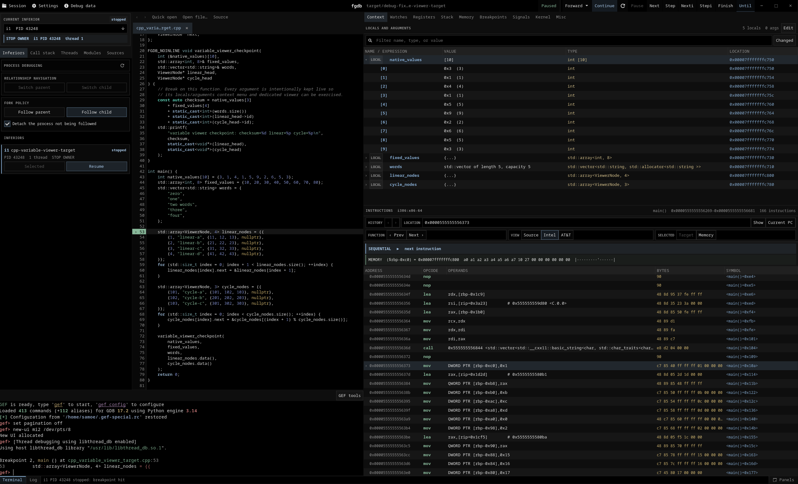

<p align="center">
  
</p>

<h1 align="center">fgdb</h1>

fgdb is a native GTK4 frontend for GDB, written in Rust. It combines graphical
inspection with an interactive GDB terminal connected to the same debugging session.

The host application supports Linux on x86_64 and aarch64 with Wayland or X11.
Windows and macOS hosts are not supported. Remote targets depend on the selected
GDB build and server.

## Requirements

| | Requirements |
| --- | --- |
| Runtime | GDB with Python 3 and `new-ui` support, GTK 4.22+, GtkSourceView 5.18+ and VTE for GTK4 0.84+ |
| Build without eBPF | Rust 1.98+, a C toolchain, pkg-config, GLib resource tools and development files for the libraries above |
| Build with eBPF | Also Clang with the BPF target, Make, libelf and zlib development files. libbpf is built from the locked Rust dependency |
| eBPF collection | A local Linux target, kernel BTF at `/sys/kernel/btf/vmlinux`, the `sys_enter` raw tracepoint and permission to load BPF tracing programs |

eBPF is used only for syscall counts. Normal debugging does not require it or
additional BPF privileges. Collection normally requires `CAP_BPF` and
`CAP_PERFMON`, subject to kernel and administrator policy. fgdb does not elevate
privileges, and the packages do not grant capabilities automatically.

Debug symbols improve source and variable inspection. GEF, language pretty printers
and rr are optional.

## Features

- Launch and attach to processes, open core dumps and connect to remote GDB servers
- Source and instruction stepping, conditional breakpoints, watchpoints and signal handling
- Separate return-value history with expandable scalars and verified aggregates after Finish and supported forward stepping
- Locals, watches, value editing and storage addresses, with array and linked-list viewers
- Registers and SIMD values, stack and memory inspection, memory search and control-flow graphs
- Threads, multiple inferiors and fork control, with Linux process, mapping and file descriptor details
- Lock waiters, ownership evidence and wait-chain navigation, with thread and memory inspection
- GDB recording and reverse execution, plus rr replay when available
- Source support for C, C++, D, Ada, Rust, Fortran, Zig and Odin, with debug-symbol lookup and pretty printers
- Saved investigations, configurable shortcuts and detachable panels

## Showcase

[](assets/showcase.png)

## Installation

### Arch Linux

Install `base-devel` and `git`, then build the included development package.

```sh
git clone https://github.com/tramasys/fgdb.git
cd fgdb/packaging/arch
makepkg -si
```

Use `FGDB_EBPF=0 makepkg -si` to build without eBPF. The package installs the binary,
desktop entry and icons. It is built from Git and is not yet published to the AUR.

### NixOS

With Nix 2.30+ and flakes enabled, install into your user profile.

```sh
nix profile add github:tramasys/fgdb
```

Use `github:tramasys/fgdb#fgdb-no-ebpf` for the build without eBPF.
Run without installing with `nix run github:tramasys/fgdb`.
The flake pins the build dependencies and Rust toolchain.

<details>
<summary>System configuration</summary>

Add the input to your system flake and the package to your NixOS configuration.

```nix
inputs.fgdb.url = "github:tramasys/fgdb";
```

```nix
environment.systemPackages = [
  inputs.fgdb.packages.${pkgs.stdenv.hostPlatform.system}.default
];
```

Pass `inputs` through `specialArgs` if your configuration is in a separate module.
Replace `default` with `fgdb-no-ebpf` to omit syscall collection.

</details>

### From source

Install the build requirements above, then run from a checkout.

```sh
cargo install --locked --path .
fgdb ./path/to/program
```

Add `--no-default-features` to the Cargo command to omit eBPF. Set `BPF_CLANG` if
the BPF-capable compiler is not named `clang`. Cargo installs the binary only.

Run `fgdb --help` for launch, attach, core dump and replay options.

---

[MIT license](LICENSE)
